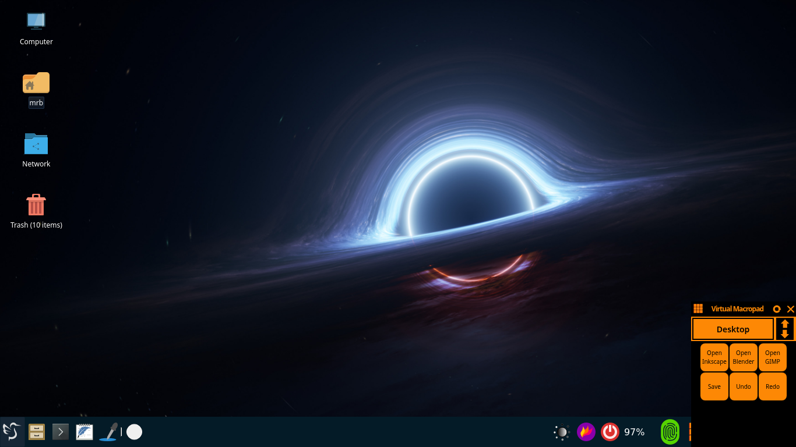
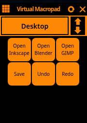
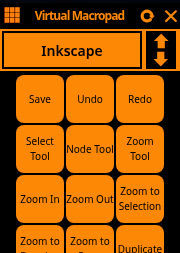

# Virtual MacroPad

A **local-first macropad system** built with **Electron + Node.js**, backed by JSON configuration, and paired with a structured Tailwind driven UI layer.

This project is designed to:

* Define **purposes** (contexts / modes)
* Bind **macros** (keys, actions, commands) to those purposes
* Serve a **desktop UI** and **web UI** from the same codebase
* Remain hackable, inspectable, and local

No telemetry. No accounts. No hidden behavior. Just software.

---

## Screenshots








---

Virtual MacroPad for Debian - developed for use with x11 i3 lightdm lxqt-panel on an aging tablet - not wayland

Runs on x11/xorg i3 lxqt lightdm not wayland

Robotjs in use - updated and patched [https://github.com/MrRedBeard/robotjs](RobotJS https://github.com/MrRedBeard/robotjs) forked from [https://github.com/jitsi/robotjs](jitsi/robotjs) which was forked from [https://github.com/octalmage/robotjs](octalmage/robotjs)

# Install dependencies
npm install

npm install github:MrRedBeard/robotjs#v0.6.21;


# Build Tailwind
npx tailwindcss -c tailwind.config.js -i ./public/assets/css/main.css -o ./public/assets/css/output.css

## Build Dev Machine
```shell
npm ci;

npm run build:css;
npm run colors;
npm run icons;

npm run build;

npm run package:deb;

git tag v0.1.1
```

## On Target Machine

From the target folder on the target machine

```Shell
./scripts/install.sh

sudo apt install --reinstall ./virtual-macropad_0.1.0_amd64.deb
```

### Purposes

A **purpose** represents an operating context (e.g. Desktop, Inkscape, CAD, Editing). Each purpose exposes a set of macros relevant to that context.

### Macros

Macros are declarative actions defined in JSON:

* Key chords
* System commands
* Purpose switching
* UI-triggered actions

### Architecture Overview

* **Electron** – Desktop container and system integration
* **Node.js services** – Macro execution and state
* **EJS + Tailwind** – Server-rendered UI
* **Static assets** – Shared between web and desktop

## Structure
```
macro-pad/
├── main.js                # Electron main process
├── preload.js             # Secure renderer <-> main bridge
├── serve.js               # Local HTTP server for UI
├── package.json           # Project metadata and dependencies
│
├── configs/
│   ├── macros.json        # Macro definitions
│   └── settings.json      # Global application settings
│
├── server_actions/
│   ├── ConfigService.js   # Load/save config and settings
│   ├── MacroEngine.js    # Macro execution logic
│   └── PurposeService.js # Purpose state + switching
│
├── views/                 # EJS templates
│   ├── layouts/
│   │   └── layout.ejs
│   ├── pages/
│   │   ├── index.ejs
│   │   ├── components.ejs
│   │   └── 404.ejs
│   └── partials/
│       ├── header.ejs
│       ├── footer.ejs
│       └── sidebar.ejs
│
├── www/
│   ├── index.html         # Static entry (fallback / demo)
│   └── content/
│       ├── css/           # Built CSS assets
│       ├── js/            # Front-end classes
│       ├── img/           # Images and icons
│       └── theme/         # Tailwind + theme logic
│
├── scripts/
│   ├── install.sh         # Local install/bootstrap
│   ├── extractColors.js  # Color tooling
│   └── tree.sh           # Tree generation helper
│
├── resources/
│   ├── icons/             # App icons (all sizes)
│   └── logo.svg
│
├── tailwind.config.js     # Tailwind configuration
├── tailwindInput/         # Tailwind reference + test pages
│
├── Roadmap.md             # Planned features (reality-checked)
├── Requirements.md        # Functional requirements
├── Development.md         # Dev notes and decisions
├── Commands.md            # Supported macro actions
├── UI_Components.md      # UI building blocks
└── LICENSE
```

---

## Configuration

### `configs/macros.json`

Defines:

* Purposes
* Buttons
* Macro actions
* Key chords

This file is the functional heart of the system.

### `configs/settings.json`

Controls global behavior:

* UI preferences
* Runtime toggles
* Default states

---

## UI Layer

* Built with **Tailwind CSS**
* Component-oriented vanilla JavaScript
* No front-end framework lock-in

UI components live in:

```
www/index.html
www/content/js/clsMacroPad.js
```

Each class maps to a discrete UI pattern (accordion, modal, timeline, toggle, etc.).